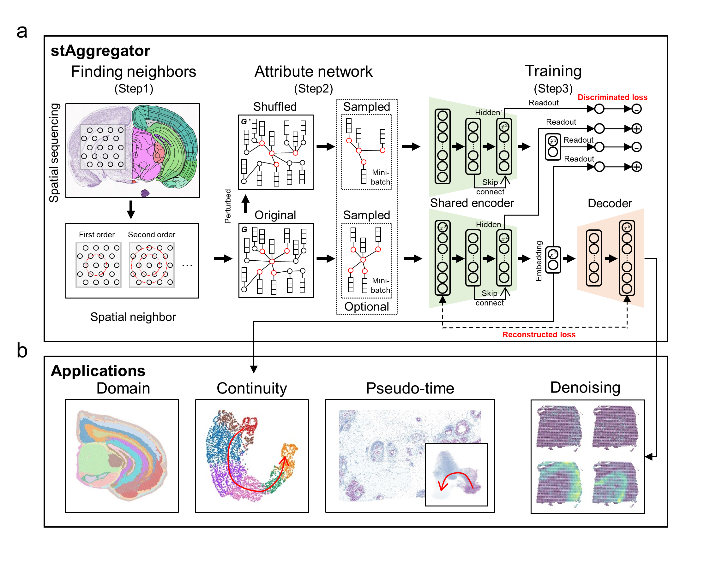

# stAggregator

## Overview
Background: 
Combining the gene expression and the spatial locations of cells to determine spatiotemporal domains is an important 
task in analyzing spatial transcriptome (ST) data. With the development of sequencing technology, new data brings 
challenges to computational models, including efficiency and robustness.

Methods: 
In this study, we propose a new method called stAggregator, which combines gene expression and spatial location to 
construct an attribute graph. Through end-to-end training with a hierarchical contrastive graph neural network (GNN), 
we obtain embeddings of each cell, which are used for downstream tasks such as spatial domain identification, 
continuous structure recognition and pseudo-time prediction. 

Results: 
We applied stAggregator to comprehensive ST datasets generated from different platforms with varying spatial 
resolutions. stAggregator shows significant improvements in performance and computational efficiency compared to 
previous methods. Additionally, stAggregator can denoise and predict pseudo-time for ST data which could bring novel 
insights for relevant research. It is foreseeable that stAggregator will become a promising method, making considerable 
contributions to the spatiotemporal analysis of ST data. 

Keywords: 
Spatial transcriptomes, GNN, Domain identification, Pseudo-time prediction, Data denoising 




## Doc
TODO
## Prerequisites

### Data

TODO
### Environment

It is recommended to use a Python version  `3.9`.
* set up conda environment for stAggregator:
```
conda create -n stAggregator python==3.9
```

```
conda activate stAggregator
```

* You need to choose the appropriate dependency pytorch and dgl for your own environment, 
and we recommend the following pytorch==1.13.1 and dgl==0.9.0 with cudatoolkit==11.6:
```
conda install cudatoolkit=11.6 -c conda-forge
pip install torch==1.13.1+cu116 torchvision==0.14.1+cu116 torchaudio==0.13.1 --extra-index-url https://download.pytorch.org/whl/cu116
pip install dgl-cu116 -f https://data.dgl.ai/wheels/repo.html
```
The other versions of pytorch and dgl can be installed from
[torch](https://pytorch.org/) and [dgl](https://www.dgl.ai/pages/start.html).


## Installation
You can install stAggregator as follows:
```
TODO
```

## Tutorials
The following are detailed tutorials. All tutorials were carried out on a notebook with a 11800H cpu and a 3070 8G gpu.

1. [stAggregator outperforms the SOTA methods in DLPFC benchmark dataset from 10X Visium platform](./0_DLPFC.ipynb).

Reference:
TODO