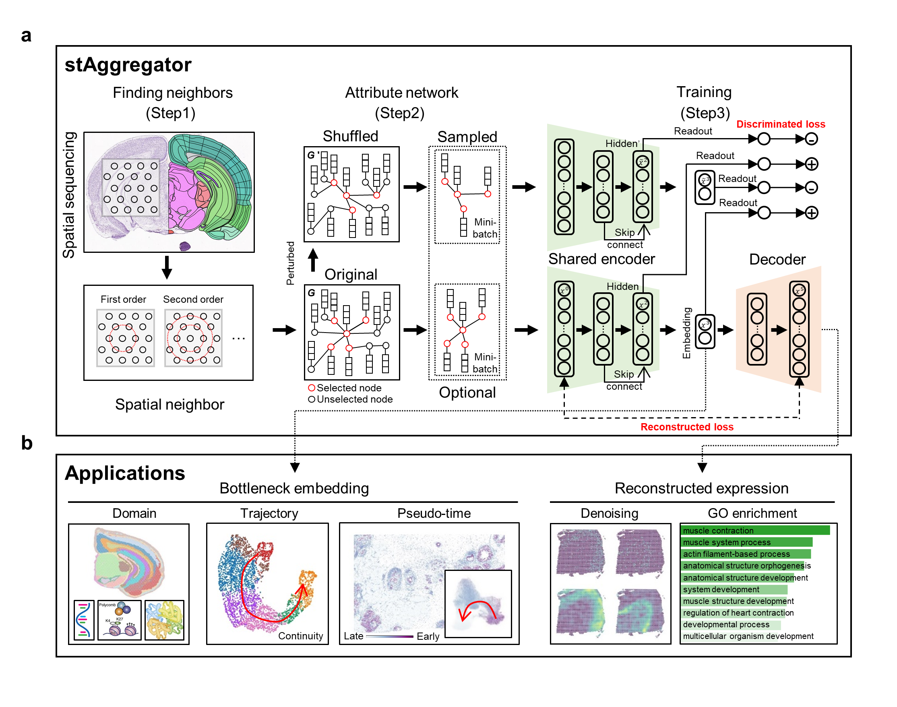

# stAggregator

## Overview
Background:
Spatial omics data analysis critically depends on integrating cellular gene expression and spatial location to identify 
spatiotemporal domains and decipher tissue functions. However, the rapidly increasing volume and complexity of these 
datasets significantly challenge the efficiency and scalability of existing computational methods.

Methods:
We introduce stAggregator, a novel method designed to overcome these challenges. stAggregator integrates gene expression 
and spatial location to construct an attributed graph. We then leverage an end-to-end hierarchical contrastive graph 
neural network (GNN) to learn robust embeddings for each spot or cell. These embeddings are universally applicable to 
various downstream tasks, including spatial domain identification, continuous structure recognition, pseudo-time 
prediction, and differential and enrichment analysis.

Results: 
We benchmarked stAggregator using a comprehensive collection of spatial omics datasets spanning multi-omics, different 
platforms, and varying resolutions and scales. Our results show that stAggregator achieves significant improvements in 
both performance and computational efficiency for domain identification compared to state-of-the-art (SOTA) methods. 
Furthermore, stAggregator effectively denoises gene expression, aids in differential and enrichment analysis, and 
accurately predicts pseudo-time. We anticipate stAggregator will become a promising and valuable tool for advanced 
analysis of spatial omics data.

Keywords: 
Spatial omics data, multi-task, GNN, Domain identification, Pseudo-time prediction, Data denoising, 
Differential and enrichment analysis



## Doc and Tutorials
Tutorials can be seen in the tutorials_github folder.
## Prerequisites

### Data
To facilitate accessibility and usability for other researchers, we have consolidated these datasets into the h5ad 
format and uploaded them to a cloud storage platform:
https://drive.google.com/drive/folders/1zNDUVfVk9twjgllQNa87KMj0izqVQbb_?usp=drive_link
### Environment

It is recommended to use a Python version  `3.9` or higher.
* Set up conda environment for stAggregator:
```
conda create -n stagg python==3.9
```
* Activate stagg:
```
conda activate stagg
```

* You need to choose the appropriate dependency pytorch and dgl for your own environment, 
and we recommend the following pytorch==1.13.1 and dgl==0.9.0 with cudatoolkit==11.6:
```
pip install torch==1.13.1+cu116 torchvision==0.14.1+cu116 torchaudio==0.13.1 --extra-index-url https://download.pytorch.org/whl/cu116
pip install dgl-cu116 -f https://data.dgl.ai/wheels/repo.html
```
The other versions of pytorch and dgl can be installed from
[torch](https://pytorch.org/) and [dgl](https://www.dgl.ai/pages/start.html).

* Additionally, you need to install the following packages:
```
pip install scanpy==1.9.3
pip install anndata==0.9.2
pip install numpy==1.26.4
pip install POT
pip install louvain
pip install leidenalg
pip install harmonypy
```

* Use R in python
```
conda install -c conda-forge r-base==4.2.0
conda install -c conda-forge r-mclust
pip install rpy2==3.5.1
```
* Install jupyter
```
pip install ipykernel
python -m ipykernel install --user --name=stagg --display-name stagg
```


## Installation
For a more detailed description of the experimental environment, please refer to the following:
```
The "requirements.txt"
```

